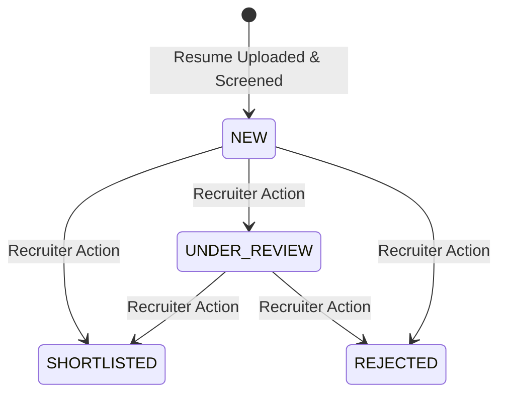

# Data Model & Schema: Resume Screening AI

**Feature**: [`spec.md`](file:///D:/Resume%20Screening%20AI%20Project/specs/001-resume-screening-ai/spec.md)
**Plan**: [`plan.md`](file:///D:/Resume%20Screening%20AI%20Project/specs/001-resume-screening-ai/plan.md)

---

## Data Schemas

### 1. `JobPosting` Entity
```sql
-- Conceptual SQL Schema (User editable)
CREATE TABLE job_postings (
    id VARCHAR(36) PRIMARY KEY,
    title VARCHAR(255) NOT NULL,
    department VARCHAR(255),
    required_skills JSON NOT NULL,        -- e.g. ["Python", "FastAPI", "PostgreSQL"]
    preferred_skills JSON,               -- e.g. ["Docker", "Redis"]
    min_years_experience INT DEFAULT 0,
    required_education VARCHAR(255),
    weight_skills FLOAT DEFAULT 0.50,    -- Configurable slider weight (0.0 to 1.0)
    weight_experience FLOAT DEFAULT 0.35,
    weight_education FLOAT DEFAULT 0.15,
    status VARCHAR(50) DEFAULT 'ACTIVE',  -- ACTIVE, ARCHIVED
    created_at TIMESTAMP DEFAULT CURRENT_TIMESTAMP,
    updated_at TIMESTAMP DEFAULT CURRENT_TIMESTAMP
);
```

### 2. `CandidateResume` Entity
```sql
CREATE TABLE candidate_resumes (
    id VARCHAR(36) PRIMARY KEY,
    file_name VARCHAR(255) NOT NULL,
    file_path VARCHAR(512) NOT NULL,
    file_size_bytes INT NOT NULL,
    raw_text TEXT,
    parsed_name VARCHAR(255),
    parsed_email VARCHAR(255),
    parsed_phone VARCHAR(50),
    extracted_skills JSON,               -- e.g. ["Python", "Docker", "SQL"]
    work_history JSON,                   -- [{company, role, duration_months, details}]
    education JSON,                      -- [{degree, institution, year}]
    parse_status VARCHAR(50) DEFAULT 'SUCCESS', -- PENDING, SUCCESS, FAILED
    parse_error_message TEXT,
    uploaded_at TIMESTAMP DEFAULT CURRENT_TIMESTAMP
);
```

### 3. `ScreeningResult` Entity
```sql
CREATE TABLE screening_results (
    id VARCHAR(36) PRIMARY KEY,
    job_id VARCHAR(36) NOT NULL REFERENCES job_postings(id),
    resume_id VARCHAR(36) NOT NULL REFERENCES candidate_resumes(id),
    stage1_similarity_score FLOAT,        -- Embedding Cosine Similarity (0-1)
    skills_sub_score FLOAT,               -- LLM evaluated (0-100)
    experience_sub_score FLOAT,           -- LLM evaluated (0-100)
    education_sub_score FLOAT,            -- LLM evaluated (0-100)
    overall_score FLOAT,                  -- Weighted sum of sub-scores (0-100)
    strengths_summary JSON,              -- List of strength bullet points
    gaps_summary JSON,                   -- List of missing requirements
    ai_reasoning TEXT,                   -- Detailed plain-language breakdown
    recruiter_status VARCHAR(50) DEFAULT 'NEW', -- NEW, SHORTLISTED, UNDER_REVIEW, REJECTED
    recruiter_feedback_notes TEXT,        -- Free-text override notes
    score_override FLOAT,                 -- Recruiter adjusted score (if any)
    evaluated_at TIMESTAMP DEFAULT CURRENT_TIMESTAMP,
    UNIQUE(job_id, resume_id)
);
```

### 4. `GapAnalysis` Entity (Candidate Career Gap Advisor)
```sql
CREATE TABLE gap_analyses (
    id VARCHAR(36) PRIMARY KEY,
    target_job_title VARCHAR(255),
    target_job_description TEXT NOT NULL,
    resume_id VARCHAR(36) REFERENCES candidate_resumes(id),
    matched_skills JSON,
    missing_skills JSON,
    missing_experience TEXT,
    suggested_action_items JSON,         -- Recommended learning / certifications
    summary_explanation TEXT,
    created_at TIMESTAMP DEFAULT CURRENT_TIMESTAMP
);
```

---

## State Machine / Status Transitions


