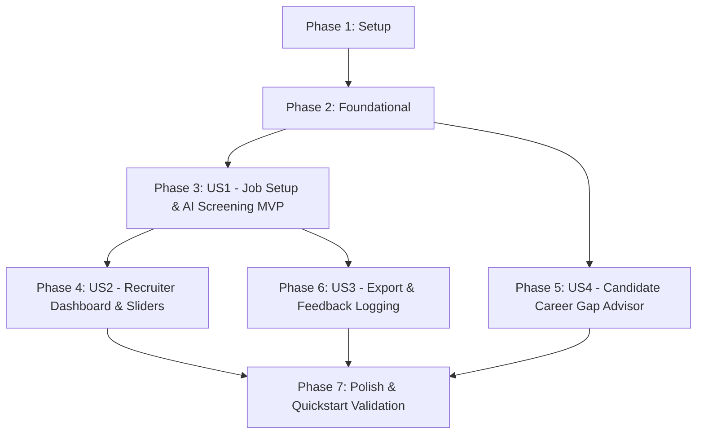

# Tasks: Resume Screening AI

**Input**: Design documents from [`specs/001-resume-screening-ai/`](file:///D:/Resume%20Screening%20AI%20Project/specs/001-resume-screening-ai/)
**Prerequisites**: [`plan.md`](file:///D:/Resume%20Screening%20AI%20Project/specs/001-resume-screening-ai/plan.md), [`spec.md`](file:///D:/Resume%20Screening%20AI%20Project/specs/001-resume-screening-ai/spec.md), [`research.md`](file:///D:/Resume%20Screening%20AI%20Project/specs/001-resume-screening-ai/research.md), [`data-model.md`](file:///D:/Resume%20Screening%20AI%20Project/specs/001-resume-screening-ai/data-model.md), [`contracts/screening-api.yaml`](file:///D:/Resume%20Screening%20AI%20Project/specs/001-resume-screening-ai/contracts/screening-api.yaml)

---

## Phase 1: Setup (Shared Infrastructure)

**Purpose**: Initialize backend and frontend project structures, dependencies, and environments.

- [x] T001 Create project directory structure for `backend/app/{api,core,models,schemas,services,repositories}` and `frontend/src/{components,pages,services,styles}`
- [x] T002 Initialize Python backend environment with `FastAPI`, `uvicorn`, `pydantic`, `sqlalchemy`, `aiosqlite`, `pdfplumber`, `google-genai`, and `sentence-transformers` in `backend/requirements.txt`
- [x] T003 [P] Initialize React frontend project with Vite and Vanilla CSS in `frontend/package.json`

---

## Phase 2: Foundational (Blocking Prerequisites)

**Purpose**: Core infrastructure that MUST be complete before ANY user story can be implemented.

- [x] T004 Setup async SQLite database connection, session lifecycle, and table initialization in `backend/app/core/database.py`
- [x] T005 [P] Configure environment settings and Gemini API key management in `backend/app/core/config.py`
- [x] T006 [P] Implement standardized API error handlers and RFC 7807 problem details response model in `backend/app/core/exceptions.py`
- [x] T007 [P] Create PDF storage utility for local file saving and retrieval in `backend/app/core/storage.py`
- [x] T008 Implement PDF text extractor using `pdfplumber` with UTF-8 text sanitization for mixed Vietnamese/English text in `backend/app/services/pdf_parser.py`

---

## Phase 3: User Story 1 - Job Requirements Setup & Automated Resume Matching (Priority: P1) 🎯 MVP

**Goal**: Enable recruiters to create Job Postings, upload PDF resumes in bulk, and run a two-stage AI screening pipeline (embedding vector shortlist + Gemini 1.5 Flash structured rerank) to score and rank candidates.

**Independent Test**: Create a Job Posting, upload 5 PDF resumes, trigger screening evaluation, and verify each candidate gets an overall match score (0-100%) and structured match breakdown.

- [x] T009 [P] [US1] Create `JobPosting` and `CandidateResume` SQLAlchemy ORM models in `backend/app/models/job_posting.py` and `backend/app/models/candidate_resume.py`
- [x] T010 [P] [US1] Create Pydantic DTO schemas for Job Posting creation and Candidate Resume parsing in `backend/app/schemas/job_posting.py` and `backend/app/schemas/candidate_resume.py`
- [x] T011 [P] [US1] Create `ScreeningResult` ORM model in `backend/app/models/screening_result.py`
- [x] T012 [US1] Implement Stage 1 vector embedding shortlist service using cosine similarity in `backend/app/services/embedding_service.py`
- [x] T013 [US1] Implement Stage 2 Gemini 1.5 Flash structured reranking service with JSON output schema in `backend/app/services/reranker_service.py`
- [x] T014 [US1] Implement Job Posting creation and Resume Bulk Upload endpoints in `backend/app/api/jobs.py` and `backend/app/api/resumes.py`
- [x] T015 [US1] Implement Screening Evaluation orchestration endpoint (`POST /api/screenings/evaluate`) in `backend/app/api/screenings.py`
- [x] T016 [P] [US1] Build Frontend Job Posting creation form in `frontend/src/components/JobPostingForm.jsx`
- [x] T017 [P] [US1] Build Frontend Drag-and-Drop PDF Bulk Upload component in `frontend/src/components/ResumeUploader.jsx`
- [x] T018 [US1] Connect Frontend upload and screening evaluation flow to API in `frontend/src/pages/JobPostingView.jsx`

---

## Phase 4: User Story 2 - Interactive Candidate Review & Screening Dashboard (Priority: P2)

**Goal**: Provide recruiters with an interactive screening dashboard to filter candidates by score/skill, inspect side-by-side AI reasoning modals, update candidate status, and recalculate scores in real-time when weight sliders change.

**Independent Test**: Load pre-screened candidate list, filter by `Score ≥ 75%`, open side-by-side AI detail modal, adjust skill weight slider, and confirm overall scores update instantly without LLM re-calls.

- [x] T019 [P] [US2] Create Pydantic schemas for candidate filtering and status updates in `backend/app/schemas/screening_result.py`
- [x] T020 [US2] Implement candidate list filtering and recruiter status update endpoints in `backend/app/api/screenings.py`
- [x] T021 [P] [US2] Build interactive Candidate Ranking Table component with client-side slider weight recalculation in `frontend/src/components/CandidateTable.jsx`
- [x] T022 [P] [US2] Build Side-by-Side Original PDF Preview vs. AI Reasoning Breakdown modal in `frontend/src/components/CandidateDetailModal.jsx`
- [x] T023 [US2] Assemble Recruiter Dashboard page with score/skill filters in `frontend/src/pages/RecruiterDashboard.jsx`

---

## Phase 5: User Story 4 - Candidate Career Gap Advisor (Priority: P2)

**Goal**: Allow job-seeking candidates to submit a CV against a target Job Description to receive a detailed gap analysis (missing skills/experience) and actionable improvement suggestions.

**Independent Test**: Upload a single CV and paste a target Job Description on the Career Gap Advisor page, trigger analysis, and verify output contains matched skills, missing skills, and suggestions in under 30 seconds.

- [x] T024 [P] [US4] Create `GapAnalysis` SQLAlchemy ORM model and Pydantic schemas in `backend/app/models/gap_analysis.py` and `backend/app/schemas/gap_analysis.py`
- [x] T025 [US4] Implement Career Gap Analysis service leveraging Gemini 1.5 Flash in `backend/app/services/gap_advisor_service.py`
- [x] T026 [US4] Implement candidate-facing Career Gap Advisor API endpoint (`POST /api/gap-advisor/analyze`) in `backend/app/api/gap_advisor.py`
- [x] T027 [P] [US4] Build Candidate-facing CV vs. JD Gap Analysis form and response view in `frontend/src/pages/GapAdvisorView.jsx`

---

## Phase 6: User Story 3 - Batch Export & Recruiter Feedback Logging (Priority: P3)

**Goal**: Enable recruiters to export shortlisted candidate summaries (CSV/PDF) and log feedback/score overrides for auditability and future reference.

**Independent Test**: Select 3 shortlisted candidates, export a CSV/PDF summary report, submit score override feedback notes, and verify notes are saved against the screening result.

- [x] T028 [US3] Add recruiter score override logging with notes and timestamp to `ScreeningResult` repository in `backend/app/repositories/screening_repository.py`
- [x] T029 [US3] Implement CSV and PDF export generator endpoint for shortlisted candidates in `backend/app/api/exports.py`
- [x] T030 [P] [US3] Build Export Shortlist button and Recruiter Feedback Notes form in `frontend/src/components/ExportFeedbackPanel.jsx`

---

## Phase 7: Polish & Cross-Cutting Concerns

**Purpose**: UI styling, performance optimization, error handling verification, and end-to-end quickstart validation.

- [x] T031 [P] Implement modern glassmorphism design system, dark/light theme, responsive layout, and animations in `frontend/src/styles/index.css`
- [x] T032 [P] Write backend API integration tests for bulk upload and screening in `backend/tests/test_screening_api.py`
- [x] T033 Execute full end-to-end validation according to `quickstart.md`

---

## Dependencies & Execution Order

---

## Task Breakdown Summary

- **Total Tasks**: 33
- **Phase 1 (Setup)**: 3 tasks
- **Phase 2 (Foundational)**: 5 tasks
- **Phase 3 (User Story 1 - P1 MVP)**: 10 tasks
- **Phase 4 (User Story 2 - P2)**: 5 tasks
- **Phase 5 (User Story 4 - P2)**: 4 tasks
- **Phase 6 (User Story 3 - P3)**: 3 tasks
- **Phase 7 (Polish)**: 3 tasks
- **Parallel Opportunities**: 16 tasks marked with `[P]`
- **MVP Scope**: Phase 1 + Phase 2 + Phase 3 (Tasks T001–T018)
